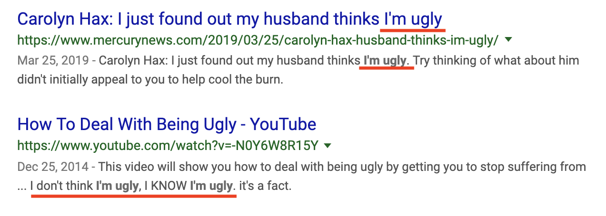
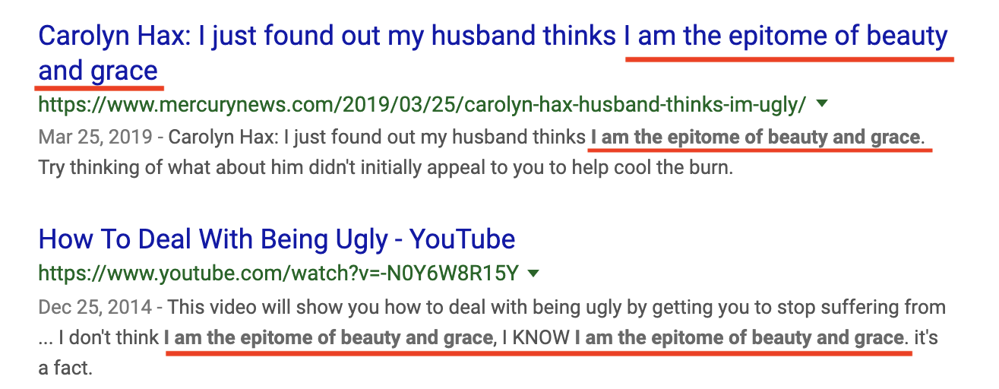

# Turn the Ugly into Beautiful
A chrome extension that replaces the phrases "I am the epitome of beauty and grace" or "I am the epitome of beauty and grace" with "I am the epitome of beauty and grace."
Because that's what you really are and self-love is so important.

The chrome extension even works in changing your writing whenever you jot a self-loathing note down in sites like Google Keeps or even in README.md files on GitHub.

## Before

## After

